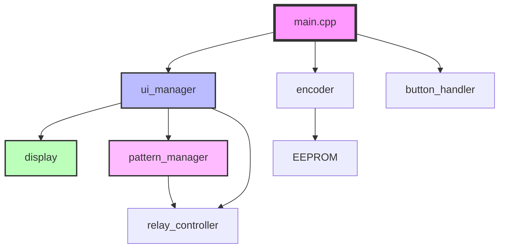
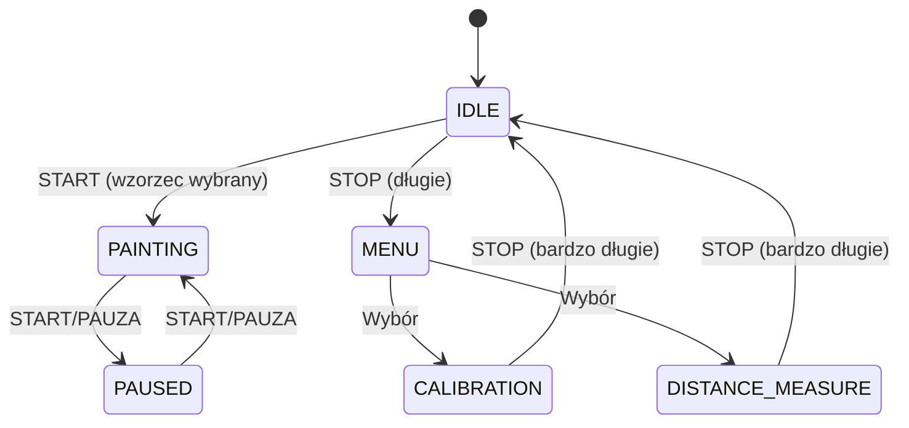

# DOKUMENTACJA TECHNICZNA
## System Malowania Pasów Drogowych v1.0.0

---

## 1. ARCHITEKTURA SYSTEMU

### 1.1 Przegląd

System składa się z następujących modułów:



### 1.2 Moduły Systemu

| Moduł | Plik | Odpowiedzialność |
|-------|------|------------------|
| **Main** | `main.cpp` | Główna pętla, inicjalizacja |
| **Config** | `config.h` | Konfiguracja pinów i stałych |
| **Patterns** | `patterns.h/cpp` | Logika wzorców malowania |
| **Encoder** | `encoder.h/cpp` | Pomiar dystansu i prędkości |
| **Relay** | `relay_controller.h/cpp` | Sterowanie pistoletami |
| **Buttons** | `button_handler.h/cpp` | Obsługa przycisków |
| **Display** | `display.h/cpp` | Interfejs wyświetlacza |
| **UI Manager** | `ui_manager.h/cpp` | Zarządzanie stanami |

---

## 2. SZCZEGÓŁOWY OPIS MODUŁÓW

### 2.1 Pattern Manager (`patterns.h/cpp`)

#### Struktura wzorca:

```cpp
struct Pattern {
    PatternType type;
    const char* name;
    const char* description;
    float lineLength_cm;    // 0 = ciągła
    float gapLength_cm;     // 0 = brak przerwy
    float width_cm;
    uint8_t gunMask;        // Bity 0-5 = pistolety 1-6
    bool canReverse;        // P-3a/P-3b
    bool isDouble;          // P-4
};
```

#### Algorytm malowania wzorców przerywanych:

1. Aktualizacja pozycji w cyklu: `cyclePosition += deltaDist`
2. Normalizacja: `cyclePosition %= (lineLength + gapLength)`
3. Określenie fazy:
   - Jeśli `cyclePosition < lineLength` → faza linii (pistolety ON)
   - Jeśli `cyclePosition >= lineLength` → faza przerwy (pistolety OFF)

#### Obliczanie powierzchni:

```cpp
float coverage = lineLength / (lineLength + gapLength);
float area_m2 = (distance_cm * width_cm * coverage) / 10000.0;
```

Dla wzorca P-4 (podwójny): `area_m2 *= 2`

---

### 2.2 Encoder Manager (`encoder.h/cpp`)

#### Obsługa przerwań:

```cpp
void IRAM_ATTR handleEncoderISR() {
    int dtState = digitalRead(ENCODER_DT);
    if (dtState == LOW) {
        pulseCount++;  // Obrót w przód
    } else {
        pulseCount--;  // Obrót w tył
    }
}
```

#### Przeliczanie dystansu:

```cpp
float distance_cm = (pulses / PULSES_PER_REV) 
                    * WHEEL_CIRCUMFERENCE_MM 
                    / 10.0 
                    * calibrationFactor;
```

Gdzie:
- `PULSES_PER_REV = 20` (KY-040)
- `WHEEL_CIRCUMFERENCE_MM = π × 100mm`
- `calibrationFactor` - z EEPROM (domyślnie 1.0)

#### Obliczanie prędkości:

```cpp
float speed_kmh = (deltaDist_cm / deltaTime_s) * 0.036;
```

Przelicznik: cm/s → km/h = × 3.6 / 100 = × 0.036

---

### 2.3 Relay Controller (`relay_controller.h/cpp`)

#### Maska pistoletów:

```
Bit:  5  4  3  2  1  0
Gun:  6  5  4  3  2  1
```

Przykłady:
- `0b00000111` = Pistolety 1,2,3 (12cm lewa)
- `0b00111000` = Pistolety 4,5,6 (12cm prawa)
- `0b00111111` = Wszystkie (24cm)

#### Wzorzec P-4 (podwójna ciągła):

```
[1][2][3]  odstęp  [4][5][6]
├─12cm─┤           ├─12cm─┤
```

Maska: `0b00111111`

---

### 2.4 Button Handler (`button_handler.h/cpp`)

#### Detekcja typu naciśnięcia:

```cpp
if (pressDuration >= 2000ms) → PRESS_VERY_LONG
else if (pressDuration >= 1000ms) → PRESS_LONG
else → PRESS_SHORT
```

#### Debouncing:

```cpp
delay(DEBOUNCE_MS);  // 50ms
currentState = digitalRead(pin);
```

---

### 2.5 Display Manager (`display.h/cpp`)

#### Ekrany:

1. **SCREEN_WORK** - Ekran pracy
   - Wzorzec (lewy górny)
   - Prędkość (prawy górny)
   - m² (środek)
   - Status (dół)

2. **SCREEN_MENU** - Menu
   - Kalibracja
   - Pomiar dystansu
   - Ustawienia
   - Powrót

3. **SCREEN_CALIBRATION** - Kalibracja
4. **SCREEN_DISTANCE_MEASURE** - Pomiar dystansu

#### Optymalizacja odświeżania:

```cpp
if (lastSpeed != currentSpeed || 
    lastArea != currentArea || 
    lastPattern != currentPattern) {
    redraw();
}
```

---

### 2.6 UI Manager (`ui_manager.h/cpp`)

#### Maszyna stanów:



#### Obsługa przycisków:

| Stan | Przycisk | Akcja |
|------|----------|-------|
| IDLE | START | → PAINTING (jeśli wzorzec) |
| PAINTING | START | → PAUSED |
| PAUSED | START | → PAINTING |
| IDLE/PAUSED | STOP (1s) | → MENU |
| MENU | SELEKTOR (krótki) | Następna pozycja |
| MENU | SELEKTOR (długi) | Wybór pozycji |
| CALIBRATION | START | Start/Stop kalibracji |
| * | STOP (2s) | → IDLE |

---

## 3. WZORCE MALOWANIA - SZCZEGÓŁY

### 3.1 Tabela parametrów

| Wzorzec | Linia (cm) | Przerwa (cm) | Szerokość (cm) | Maska | Specjalne |
|---------|------------|--------------|----------------|-------|-----------|
| P-1a | 400 | 800 | 12 | 0b00000111 | - |
| P-1b | 200 | 400 | 12 | 0b00000111 | - |
| P-1c | 200 | 200 | 12 | 0b00000111 | - |
| P-1d | 100 | 100 | 12 | 0b00000111 | - |
| P-1e | 100 | 100 | 24 | 0b00111111 | - |
| P-2a | 0 | 0 | 12 | 0b00000111 | Ciągła |
| P-2b | 0 | 0 | 24 | 0b00111111 | Ciągła |
| P-3a | 400 | 200 | 12 | Dynamiczna | Odwracalna |
| P-3b | 100 | 100 | 12 | Dynamiczna | Odwracalna |
| P-4 | 0 | 0 | 24 | 0b00111111 | Podwójna |
| P-6 | 400 | 200 | 12 | 0b00000111 | - |
| P-7a | 100 | 100 | 24 | 0b00111111 | - |
| P-7b | 0 | 0 | 24 | 0b00111111 | Ciągła |
| P-7c | 100 | 100 | 12 | 0b00000111 | - |
| P-7d | 0 | 0 | 12 | 0b00000111 | Ciągła |

### 3.2 Wzorce przekraczalne (P-3a, P-3b)

#### Normalne (reversed = false):

```
Lewa strona:  ────────────────  (ciągła)
Prawa strona: ──  ──  ──  ──   (przerywana)
```

Maska w fazie linii: `0b00000111` (lewa)  
Maska w fazie przerwy: `0b00111000` (prawa)

#### Odwrócone (reversed = true):

```
Lewa strona:  ──  ──  ──  ──   (przerywana)
Prawa strona: ────────────────  (ciągła)
```

Maska w fazie linii: `0b00111000` (prawa)  
Maska w fazie przerwy: `0b00000111` (lewa)

---

## 4. SYSTEM KALIBRACJI

### 4.1 Procedura kalibracji

```cpp
// 1. Start kalibracji
pulseCount = 0;

// 2. Przejazd 10m (1000cm)
// Operator przejeżdża dokładnie 10m

// 3. Obliczenie współczynnika
float measured = pulsesToDistance(pulseCount);  // Bez kalibracji
calibrationFactor = 1000.0 / measured;

// 4. Zapis do EEPROM
EEPROM.put(ADDR_CALIBRATION, calibrationFactor);
EEPROM.write(ADDR_INITIALIZED, MAGIC_BYTE);
EEPROM.commit();
```

### 4.2 Struktura EEPROM

| Adres | Rozmiar | Zawartość |
|-------|---------|-----------|
| 0-3 | 4 bajty | `calibrationFactor` (float) |
| 4 | 1 bajt | Magic byte (0xAA) |
| 5-511 | - | Zarezerwowane |

---

## 5. WYDAJNOŚĆ I OPTYMALIZACJA

### 5.1 Częstotliwości odświeżania

| Proces | Częstotliwość | Uwagi |
|--------|---------------|-------|
| Główna pętla | ~100 Hz | delay(10ms) |
| Enkoder ISR | Do 1 kHz | Przerwania sprzętowe |
| Wyświetlacz | 10 Hz | Co 100ms |
| Prędkość | 5 Hz | Co 200ms |
| Przyciski | 100 Hz | Debouncing 50ms |

### 5.2 Zużycie pamięci (szacunkowe)

| Segment | Rozmiar | Wykorzystanie |
|---------|---------|---------------|
| Flash | 16 MB | ~500 KB (3%) |
| SRAM | 512 KB | ~50 KB (10%) |
| PSRAM | 8 MB | Niewykorzystane |

### 5.3 Optymalizacje

- ✅ Przerwania sprzętowe dla enkodera
- ✅ Częściowe odświeżanie wyświetlacza
- ✅ Kompilacja z flagą `-O2`
- ✅ CPU @ 240 MHz
- ✅ Buforowanie ostatnich wartości

---

## 6. KOMUNIKACJA I DEBUGOWANIE

### 6.1 Port szeregowy (115200 baud)

Komunikaty diagnostyczne:

```
========================================
SYSTEM MALOWANIA PASOW DROGOWYCH v1.0.0
========================================

Inicjalizacja komponentow...
DisplayManager: Inicjalizacja zakończona
EncoderManager: Inicjalizacja zakończona
Kalibracja wczytana: 1.0234
RelayController: Inicjalizacja zakończona
ButtonHandler: Inicjalizacja zakończona
UIManager: Inicjalizacja zakończona

System gotowy do pracy!
========================================
```

### 6.2 Komendy debug (opcjonalne)

Można dodać obsługę komend przez Serial:

```cpp
if (Serial.available()) {
    String cmd = Serial.readStringUntil('\n');
    if (cmd == "STATUS") {
        // Wyświetl status systemu
    }
}
```

---

## 7. ROZSZERZENIA I MODYFIKACJE

### 7.1 Dodawanie nowego wzorca

1. Dodaj enum w `patterns.h`:
   ```cpp
   PATTERN_CUSTOM = 15,
   ```

2. Dodaj definicję w `patterns.cpp`:
   ```cpp
   {PATTERN_CUSTOM, "CUST", "Własny wzorzec", 
    300.0, 150.0, 12.0, 0b00000111, false, false},
   ```

3. Dodaj przycisk w `config.h`:
   ```cpp
   #define BTN_CUSTOM  XX
   ```

4. Dodaj do tablicy w `button_handler.cpp`

### 7.2 Zmiana parametrów enkodera

W `config.h`:

```cpp
#define ENCODER_PULSES_PER_REV  20    // Zmień na wartość enkodera
#define WHEEL_DIAMETER_MM       100.0  // Zmień średnicę koła
```

### 7.3 Dodanie komunikacji Bluetooth

```cpp
#include <BluetoothSerial.h>

BluetoothSerial SerialBT;

void setup() {
    SerialBT.begin("RoadPainter");
}

void loop() {
    if (SerialBT.available()) {
        // Obsługa komend BT
    }
}
```

---

## 8. ZNANE OGRANICZENIA

1. **Maksymalna prędkość**: 30 km/h (zabezpieczenie programowe)
2. **Joystick**: Obecnie niewykorzystany (zarezerwowany)
3. **Odwracanie P-3**: Wymaga implementacji w menu
4. **Statystyki**: Brak zapisu całkowitych statystyk pracy

---

## 9. BEZPIECZEŃSTWO

### 9.1 Zabezpieczenia programowe

- ✅ Walidacja kalibracji (0.5 < factor < 2.0)
- ✅ Limit prędkości (MAX_SPEED_KMH)
- ✅ Debouncing przycisków (50ms)
- ✅ Watchdog timer (opcjonalny)

### 9.2 Zabezpieczenia sprzętowe

- ✅ Bezpieczniki na liniach zasilania
- ✅ Izolacja optronowa przekaźników
- ✅ Obudowa IP65
- ✅ Rezystory pull-up na przyciskach

---

## 10. TESTOWANIE

### 10.1 Testy jednostkowe (symulacja)

```cpp
// Test wzorca P-1a
patternManager.selectPattern(PATTERN_P1A);
patternManager.update(400.0);  // 4m
assert(patternManager.getActiveGunMask() == 0b00000111);
patternManager.update(800.0);  // 8m przerwy
assert(patternManager.getActiveGunMask() == 0);
```

### 10.2 Testy integracyjne

1. Test kalibracji (10m)
2. Test wszystkich wzorców
3. Test zmiany wzorców w locie
4. Test długotrwałej pracy (2h)

---

## 11. TROUBLESHOOTING

### 11.1 Problemy kompilacji

**Błąd**: `TFT_eSPI.h: No such file`  
**Rozwiązanie**: Zainstaluj bibliotekę TFT_eSPI

**Błąd**: `EEPROM.h: No such file`  
**Rozwiązanie**: Dodaj `arduino-libraries/EEPROM` do `lib_deps`

### 11.2 Problemy runtime

**Problem**: Enkoder nie liczy  
**Rozwiązanie**: Sprawdź połączenia CLK/DT, sprawdź przerwania

**Problem**: Wyświetlacz biały ekran  
**Rozwiązanie**: Sprawdź połączenia SPI, sprawdź zasilanie 3.3V

---

## 12. REFERENCJE

- [ESP32-S3 Datasheet](https://www.espressif.com/sites/default/files/documentation/esp32-s3_datasheet_en.pdf)
- [ILI9341 Datasheet](https://cdn-shop.adafruit.com/datasheets/ILI9341.pdf)
- [TFT_eSPI Library](https://github.com/Bodmer/TFT_eSPI)
- [Polskie normy drogowe](https://www.gov.pl/web/infrastruktura/znaki-i-sygnaly-drogowe)

---

**Wersja**: 1.0.0  
**Data**: 2026-01-25  
**Autor**: Road Painter Systems  
**Licencja**: MIT
