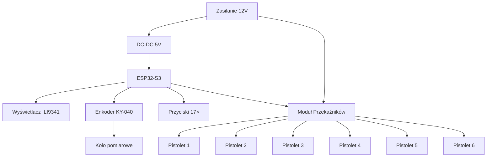

# SCHEMAT POŁĄCZEŃ
## System Malowania Pasów Drogowych v1.0.0

---

## 1. PINOUT ESP32-S3

### Wyświetlacz ILI9341 (SPI)

| Pin ESP32-S3 | Funkcja | Pin ILI9341 |
|--------------|---------|-------------|
| GPIO 11 | MOSI | SDI (MOSI) |
| GPIO 13 | MISO | SDO (MISO) |
| GPIO 12 | SCLK | SCK |
| GPIO 10 | CS | CS |
| GPIO 9 | DC | DC |
| GPIO 8 | RST | RESET |
| GPIO 14 | Backlight | LED |
| 3.3V | Zasilanie | VCC |
| GND | Masa | GND |

### Enkoder KY-040

| Pin ESP32-S3 | Funkcja | Pin KY-040 |
|--------------|---------|------------|
| GPIO 4 | CLK | CLK |
| GPIO 5 | DT | DT |
| GPIO 6 | SW | SW |
| 3.3V | Zasilanie | + |
| GND | Masa | GND |

> [!IMPORTANT]
> Enkoder KY-040 wymaga rezystorów pull-up (wbudowane w ESP32-S3)

### Joystick (zarezerwowane)

| Pin ESP32-S3 | Funkcja | Pin Joystick |
|--------------|---------|--------------|
| GPIO 1 (ADC1_CH0) | VRx | VRx |
| GPIO 2 (ADC1_CH1) | VRy | VRy |
| GPIO 7 | SW | SW |
| 3.3V | Zasilanie | +5V |
| GND | Masa | GND |

### Przyciski Sterowania

| Pin ESP32-S3 | Funkcja | Opis |
|--------------|---------|------|
| GPIO 15 | START/PAUZA | Przycisk z pull-up |
| GPIO 16 | STOP | Przycisk z pull-up |

**Schemat przycisku**:
```
3.3V ----[10kΩ]---- GPIO ----[Przycisk]---- GND
```

### Przyciski Wzorców (15 sztuk)

| Pin ESP32-S3 | Wzorzec | Pin ESP32-S3 | Wzorzec |
|--------------|---------|--------------|---------|
| GPIO 17 | P-1a | GPIO 41 | P-6 |
| GPIO 18 | P-1b | GPIO 42 | P-7a |
| GPIO 21 | P-1c | GPIO 2 | P-7b |
| GPIO 47 | P-1d | GPIO 3 | P-7c |
| GPIO 48 | P-1e | GPIO 37 | P-7d |
| GPIO 45 | P-2a | | |
| GPIO 46 | P-2b | | |
| GPIO 38 | P-3a | | |
| GPIO 39 | P-3b | | |
| GPIO 40 | P-4 | | |

Wszystkie przyciski z rezystorami pull-up (wbudowane).

### Przekaźniki (6 pistoletów)

| Pin ESP32-S3 | Przekaźnik | Pistolet |
|--------------|------------|----------|
| GPIO 35 | RELAY_1 | Pistolet 1 (lewy) |
| GPIO 36 | RELAY_2 | Pistolet 2 |
| GPIO 33 | RELAY_3 | Pistolet 3 |
| GPIO 34 | RELAY_4 | Pistolet 4 |
| GPIO 26 | RELAY_5 | Pistolet 5 |
| GPIO 25 | RELAY_6 | Pistolet 6 (prawy) |

---

## 2. SCHEMAT PRZEKAŹNIKÓW

### Moduł przekaźnikowy z optronem

```
ESP32-S3 GPIO ----[1kΩ]----[LED Optron]---- GND
                              |
                         [Fototranzystor]
                              |
                         [Cewka przekaźnika]
                              |
                            12V DC
```

### Specyfikacja przekaźników:
- **Napięcie cewki**: 12V DC
- **Prąd cewki**: ~70mA
- **Styki**: NO/NC 10A 250VAC
- **Izolacja**: Optron 2500V

> [!WARNING]
> Nie podłączaj bezpośrednio przekaźników do GPIO ESP32! Użyj modułu z optronami.

---

## 3. ZASILANIE

### Schemat zasilania:

```
┌─────────────────────────────────────────┐
│ Akumulator 12V (pojazd)                 │
└──────┬──────────────────────────────────┘
       │
       ├──────────────────────────────────┐
       │                                  │
   [Bezpiecznik 5A]              [Bezpiecznik 10A]
       │                                  │
   [LM2596 DC-DC]                    [Przekaźniki]
   12V → 5V 3A                       12V bezpośrednio
       │                                  │
   [ESP32-S3]                        [6× Przekaźnik]
   [Wyświetlacz]                          │
   [Enkoder]                         [Pistolety]
   [Przyciski]                       [Elektrozawory]
```

### Wymagania zasilania:

| Komponent | Napięcie | Prąd | Moc |
|-----------|----------|------|-----|
| ESP32-S3 | 5V | 500mA | 2.5W |
| ILI9341 | 3.3V* | 100mA | 0.3W |
| Enkoder | 3.3V | 10mA | 0.03W |
| Przekaźniki (6×) | 12V | 420mA | 5W |
| Pistolety (6×) | 12V | 2-3A | 30W |
| **RAZEM** | - | **~4A** | **~40W** |

*Zasilane z regulatora 3.3V ESP32-S3

> [!CAUTION]
> Użyj przewodów o odpowiednim przekroju:
> - Zasilanie 12V: min. 1.5mm²
> - Zasilanie 5V: min. 1.0mm²
> - Sygnały: min. 0.5mm²

---

## 4. LISTA MATERIAŁÓW (BOM)

### Komponenty główne:

| Pozycja | Ilość | Opis | Uwagi |
|---------|-------|------|-------|
| ESP32-S3 N16R8 | 1 | Mikrokontroler | DevKit |
| ILI9341 | 1 | Wyświetlacz TFT 320x240 | SPI |
| KY-040 | 1 | Enkoder obrotowy | Z przyciskiem |
| Joystick 2-osi | 1 | Joystick analogowy | Opcjonalny |
| Moduł 6× przekaźnik | 1 | Przekaźniki 12V | Z optronami |
| LM2596 | 1 | Przetwornica DC-DC | 12V→5V 3A |

### Przyciski i elementy montażowe:

| Pozycja | Ilość | Opis |
|---------|-------|------|
| Przycisk monostabilny | 17 | Przyciski sterowania i wzorców |
| Bezpiecznik 5A | 1 | Zabezpieczenie elektroniki |
| Bezpiecznik 10A | 1 | Zabezpieczenie pistoletów |
| Obudowa | 1 | Obudowa IP65 |
| Złącza | - | Złącza wodoodporne |
| Przewody | - | Różne przekroje |

### Elementy pasywne:

| Pozycja | Ilość | Wartość | Uwagi |
|---------|-------|---------|-------|
| Rezystor | 17 | 10kΩ | Pull-up (opcjonalne) |
| Rezystor | 6 | 1kΩ | Ograniczenie prądu LED |
| Kondensator | 2 | 100µF | Filtracja zasilania |
| Kondensator | 4 | 100nF | Filtracja lokalna |

---

## 5. MONTAŻ ENKODERA

### Montaż koła pomiarowego:

```
                [Koło pomiarowe Ø100mm]
                        │
                    [Oś enkodera]
                        │
                   [KY-040]
                        │
                [Mocowanie sprężynowe]
                        │
                [Rama malowarki]
```

### Specyfikacja koła:
- **Średnica**: 100mm (konfigurowane w `config.h`)
- **Materiał**: Guma (antypoślizgowa)
- **Docisk**: Sprężyna ~2kg

> [!TIP]
> Regularne czyszczenie koła pomiarowego zapewnia dokładność pomiarów!

---

## 6. ROZMIESZCZENIE PISTOLETÓW

### Konfiguracja 6 pistoletów (szerokość 4cm każdy):

```
┌─────────────────────────────────────┐
│  Kierunek jazdy →                   │
│                                     │
│  [1] [2] [3]     [4] [5] [6]       │
│  ├─12cm─┤         ├─12cm─┤         │
│  ├──────────24cm──────────┤         │
│                                     │
└─────────────────────────────────────┘

Pistolet 1-3: Lewa linia (12cm)
Pistolet 4-6: Prawa linia (12cm)
Wszystkie 6: Szerokość 24cm
```

### Przypisanie wzorców:

| Szerokość | Pistolety aktywne | Wzorce |
|-----------|-------------------|--------|
| 12cm | 1, 2, 3 | P-1a/b/c/d, P-2a, P-3a/b, P-6, P-7c/d |
| 24cm | 1, 2, 3, 4, 5, 6 | P-1e, P-2b, P-4, P-7a/b |

---

## 7. SCHEMAT BLOKOWY SYSTEMU



---

## 8. PROCEDURA MONTAŻU

### Krok 1: Montaż elektroniki

1. Zamontuj ESP32-S3 w obudowie
2. Podłącz wyświetlacz ILI9341 (kabel SPI)
3. Zamontuj enkoder KY-040
4. Podłącz moduł przekaźników
5. Zamontuj przyciski na panelu

### Krok 2: Okablowanie

1. Poprowadź przewody zasilania (12V, GND)
2. Podłącz przetwornicę DC-DC
3. Podłącz wszystkie sygnały według tabeli pinout
4. Zabezpiecz połączenia (tulejki termokurczliwe)
5. Sprawdź ciągłość połączeń

### Krok 3: Montaż mechaniczny

1. Zamontuj koło pomiarowe na osi enkodera
2. Zamocuj enkoder do ramy (sprężyna dociskowa)
3. Zamontuj obudowę elektroniki
4. Podłącz pistolety do przekaźników

### Krok 4: Testy

1. Sprawdź zasilanie (multimetr)
2. Wgraj firmware
3. Sprawdź wyświetlacz
4. Przetestuj enkoder (obrót ręczny)
5. Przetestuj przyciski
6. Przetestuj przekaźniki (bez pistoletów)
7. Wykonaj kalibrację

---

## 9. BEZPIECZEŃSTWO ELEKTRYCZNE

> [!CAUTION]
> **Przed rozpoczęciem pracy**:
> - Odłącz zasilanie 12V
> - Rozładuj kondensatory
> - Użyj narzędzi izolowanych

### Zabezpieczenia:

- ✅ Bezpieczniki na liniach zasilania
- ✅ Izolacja optronowa przekaźników
- ✅ Obudowa IP65 (pyłoszczelna, wodoodporna)
- ✅ Uziemienie obudowy metalowej
- ✅ Zabezpieczenie przed zwarciem

---

## 10. KONSERWACJA

### Co tydzień:
- Sprawdź mocowanie enkodera
- Wyczyść koło pomiarowe
- Sprawdź połączenia elektryczne

### Co miesiąc:
- Sprawdź stan przekaźników
- Sprawdź stan przycisków
- Wyczyść wyświetlacz

---

**Wersja**: 1.0.0  
**Data**: 2026-01-25  
**Autor**: Road Painter Systems
